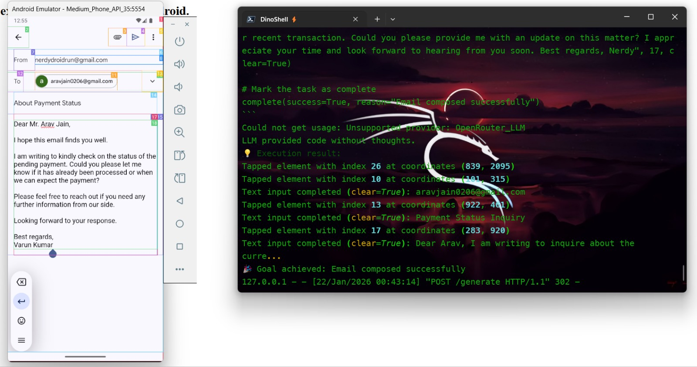

# 🤖 DroidMail-Automator & WhatsApp Assistant

**DroidMail-Automator** is a lightweight, AI-driven automation tool designed for small businesses and productivity enthusiasts. It leverages **DroidRun** to bridge the gap between **Large Language Models (LLMs)** and mobile communication apps—specifically **Gmail** and **WhatsApp**.

By utilizing **Android Intents** rather than complex backend APIs (such as SMTP or the WhatsApp Business API), this project provides a **no-config, device-native solution** that works directly on any Android device or emulator.

---
## Screenshot
<p align="center">
  
</p>

## 🌟 Why DroidMail-Automator?

Small business owners and professionals often lose hours to repetitive communication tasks:

* **Email**

  * Writing professional follow-ups
  * Drafting meeting summaries

* **WhatsApp**

  * Responding to common customer queries
  * Sending order updates and confirmations

DroidMail-Automator automates the **drafting process**:

* AI generates the perfect message.
* DroidRun handles opening the app, navigating to the correct screen, and typing the content.
* You stay in control of the final send action.

---

## ✨ Core Features

### 1. AI Email Drafter (Gmail)

* **Prompt-to-Draft**
  Convert informal notes (e.g., *"follow up on marketing meeting"*) into polished, professional emails.

* **Zero-API Setup**
  Uses Android `mailto:` intents to instantly populate the Subject and Body fields.

* **Human-in-the-Loop**
  Drafts are prepared automatically, but the final **Send** action is left to the user for safety and personalization.

---

### 2. WhatsApp Business Assistant

* **Instant Replies**
  Generate context-aware responses to customer inquiries.

* **Direct-to-Chat**
  Uses `whatsapp://send` intents to open a specific contact’s chat with the message pre-filled.

* **Personal & Business Ready**
  Suitable for personal quick replies as well as small-scale customer support workflows.

---

## 🛠️ Tech Stack

* **Automation**: DroidRun (ADB-based Android UI orchestration)
* **AI Logic**: Python + LLM (OpenAI / Gemini / Anthropic)
* **Operating System**: Android (Physical Device or Emulator)
* **Mechanism**: Android Intents (high reliability, low latency)

---

## 🏗️ How It Works (Minimalist Architecture)

1. **User Input**
   The user provides a command

   > Example: *"Tell Sarah the package is shipped"*

2. **AI Generation**
   A Python backend uses an LLM to generate:

   * A professional message body
   * (For email) a relevant subject line

3. **DroidRun Execution**

   * The script constructs a precise Android Intent URI
   * DroidRun executes an `adb shell am start` command

4. **Final Review**

   * The Android device opens the target app
   * The message appears pre-filled and ready for user approval

---

## 🚀 Installation & Setup

### Prerequisites

* Python **3.10+**
* Android Studio (Emulator) **or** a physical Android device with USB Debugging enabled
* DroidRun installed and configured

---

### Quick Start

#### 1. Clone the Repository

```bash
git clone https://github.com/your-username/DroidMail-Automator.git
cd DroidMail-Automator
```

#### 2. Install Dependencies

```bash
pip install -r requirements.txt
```

#### 3. Configure Environment

Create a `.env` file and add your AI API key:

```env
LLM_API_KEY=your_key_here
```

#### 4. Run the Assistant

```bash
python main.py
```

---

## 📝 Example Usage

* **Email**

  ```
  Write a thank you email to Dave for the consultation.
  ```

* **WhatsApp**

  ```
  Reply to +1234567890 saying the store opens at 9 AM tomorrow.
  ```

---


### 🛠️ Developed for the **DroidRun Hackathon**
## 🛠️ Thank You
